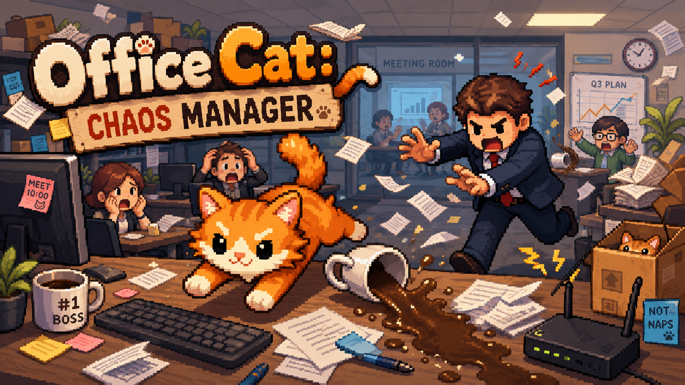
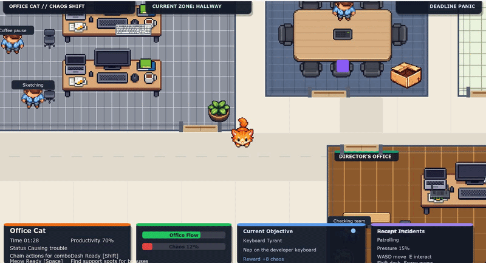

# Office Cat: Chaos Manager

Turn a productive office into a beautifully managed disaster.



**Office Cat: Chaos Manager** is a humorous top-down 2D chaos game where you play as an orange office cat sabotaging a deadline-driven workplace. Employees try to stay focused. The manager tries to restore order. You do what any self-respecting cat would do: nap on keyboards, knock over mugs, break workflows, and push the entire office toward total collapse.

## Why This Demo Stands Out

This is not just a static prototype or a movement sandbox. The current demo already includes:

- A playable **top-down office chaos loop**
- A **scrolling world** larger than the visible screen
- Multiple office zones with distinct layouts
- Interactive sabotage actions with chaos gain
- Employees with different workplace roles and behavior patterns
- A manager that patrols, investigates, chases, searches, and creates pressure zones
- A HUD, objective system, combo system, timer, incident feed, and support spots

The result is a compact but expressive vertical slice of a comedy stealth-chaos game.

## Game Premise

The office is on a deadline.

The team needs focus, discipline, and stable Wi-Fi.

Unfortunately for them, an orange cat has other plans.

Your goal is to fill the **Chaos Meter** to 100% before the workday ends. You do that by exploring the office, finding sabotage opportunities, distracting employees, avoiding the manager, and chaining together increasingly disruptive cat behavior.

## Current Demo Features

### Core Gameplay

- Smooth top-down player movement
- Keyboard controls
- Dash ability
- Manual meow distraction
- Hide spots
- Combo-based chaos scoring
- Win / lose loop with restart flow

### Sabotage Interactions

- Nap on a keyboard
- Knock over a mug
- Disable Wi-Fi
- Interrupt a meeting
- Scatter paperwork

### Office Simulation Layer

- Employees react to events and the player
- Employee roles:
  - Developer
  - Designer
  - Analyst
  - Lead
- Employees follow small work routines and short break behaviors
- Manager patrols the office and reacts to chaos
- Manager can chase, search last known positions, investigate incidents, and mark danger zones

### World & Presentation

- Multi-room office map with camera-following larger world
- Open space, meeting room, kitchen, and director's office
- Door-based room access
- Pixel-art character and prop integration
- HUD with chaos, productivity, objectives, incidents, and manager pressure

## Controls

- `WASD` or Arrow Keys: Move
- `E`: Interact / Use object / Enter or leave hide spot
- `Shift`: Dash
- `Space`: Meow
- `Esc` or `P`: Pause
- `R`: Restart current run
- `Enter`: Start from menu / Return to menu after end screen

## Tech Stack

- **Java 17**
- **JavaFX 17**
- **Gradle**
- Modular Java application setup

This project is currently built as a code-driven JavaFX game without a heavyweight engine, which makes the gameplay systems explicit, lightweight, and easy to extend.

## Project Structure

```text
src/main/java/cat/game/officecatgame/
  OfficeCatApplication.java   # JavaFX entry point
  GameScreen.java             # Main game loop, world, rendering, UI, orchestration
  PlayerCat.java              # Player movement, dash, temporary effects
  EmployeeNpc.java            # Employee AI roles, routines, reactions
  ManagerNpc.java             # Manager patrol / chase / search logic
  ChaosInteraction.java       # Sabotage interaction data
  ChaosEvent.java             # Temporary chaos event data
  ChaosObjective.java         # Objective system
  CatSupportSpot.java         # Positive support spots like snack / sunbeam
  DangerZone.java             # Manager-created risky areas
  FloatingText.java           # Feedback popups
  IncidentFeedEntry.java      # HUD incident feed entries
  HideSpot.java               # Hide interaction points
  InputState.java             # Input tracking
  SpriteLoader.java           # Sprite loading helpers
  Point.java / Rect.java      # Utility data objects

src/main/resources/assets/
  sprites/                    # Characters and props
  tiles/                      # Environment art
```

## Running The Demo

### Requirements

- Java 17+

### Launch

```bash
./gradlew run
```

On Windows:

```bash
gradlew.bat run
```

### Build

```bash
./gradlew build
```

## Current State

This repository represents an **active demo build**.

It already shows the core fantasy of the game:

- playful destruction
- readable office spaces
- reactive NPC behavior
- escalating cat-driven chaos

### Demo Preview



At the same time, it is still in active development, with room for improvement in:

- environment art polish
- more advanced pathfinding
- stronger animation feedback
- richer sabotage sequences
- audio, particles, and final game feel


## License

See [LICENSE](./LICENSE).
